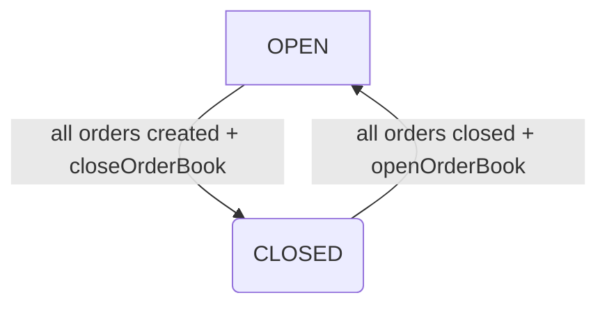
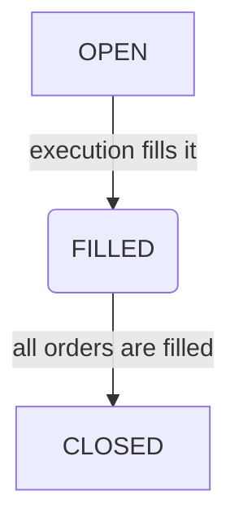

# orderbook

Execute with JDK17

H2 console: http://localhost:8080/h2-console/ connect as Generic H2 (Embedded), org.h2.Driver, jdbc:h2:mem:orders, sa/password

Swagger: http://localhost:8080/v2/api-docs  http://localhost:8080/swagger-ui/index.html#/order-controller

Unittests are modelled in src/main/resources/static/ordermodel.ods  (you need Apache Open Office or Excel to view it)

One the application is started, one can execute curlrequests.http to prepopulate the DB

http://localhost:8080/order/v1/executionReportPDF export the PDF from the browser

# Remarks

Lombok has regrettably not been used because not "production ready" - to be verified.

Validation has been skipped for brevity

Security also skipped for ease of demoing

In the DB the validation of enumerated columns is missing - it should be implemented by triggers of by CHECK constraint

Builder pattern not use for brevity  

# References

https://spring.io/guides/tutorials/rest/
https://spring.io/guides/gs/testing-web/
https://www.springboottutorial.com/spring-boot-swagger-documentation-for-rest-services

https://jsonpath.com/

https://www.baeldung.com/entity-to-and-from-dto-for-a-java-spring-application
https://www.baeldung.com/java-modelmapper-lists

Lifecycle of an OrderBook

Lifecycle of an OrderEntry

